# Visual studio shortcuts
A guide to shortcuts in Visual Studio 2019. Some shortcuts have animations to better show how they work.

> ⚠ The list is far from complete!

## Edit
### .AddEventHandler
### .AddResource
### .AddRow
### .AddTagHandler

🤷‍♂️

### .BreakLine

1. Insert a new line when at end of line.

    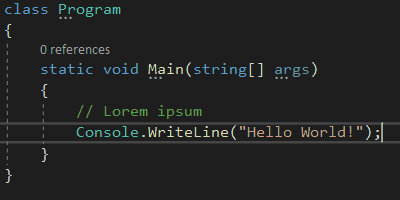

1. Insert new line with anything in front of cursor to the new line.

    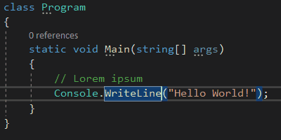

### .BriefBookmarkDrop0	
### .BriefBookmarkDrop1	
### .BriefBookmarkDrop2	
### .BriefBookmarkDrop3	
### .BriefBookmarkDrop4	
### .BriefBookmarkDrop5	
### .BriefBookmarkDrop6	
### .BriefBookmarkDrop7	
### .BriefBookmarkDrop8	
### .BriefBookmarkDrop9	
### .BriefBookmarks	
### .BriefBreakLine	
### .BriefBrowse	
### .BriefFileExit	
### .BriefFilePrint	
### .BriefFind	
### .BriefFindPrev	
### .BriefFindRepeat	
### .BriefFindReplace	
### .BriefFindToggleCaseSensitivity	
### .BriefFindToggleRegExpr	
### .BriefGoTo	
### .BriefGoToNextErrorTag	
### .BriefInsertFile	
### .BriefLineDelete	
### .BriefLineDeleteToEnd	
### .BriefLineDeleteToStart	
### .BriefLineIndent	
### .BriefLineOpenBelow	
### .BriefLineUnindent	
### .BriefQuotedInsert	
### .BriefSelectChar	
### .BriefSelectCharInclusive	
### .BriefSelectColumn	
### .BriefSelectLine	
### .BriefSelectSwapAnchor	
### .BriefSetRepeatCount	
### .BriefWindowLeftEdge	
### .BriefWindowMaximize	
### .BriefWindowRightEdge	
### .BriefWindowScrollDown	
### .BriefWindowScrollToBottom	
### .BriefWindowScrollToCenter	
### .BriefWindowScrollToTop	
### .BriefWindowScrollUp	
### .BriefWindowSplit	
### .BriefWindowSwitchPane	
### .BriefWordDeleteToEnd	
### .BriefWordDeleteToStart	
### .BriefWordLeft	
### .BriefWordRight

> 🛈 Obsolete

These are relics from versions before VS2010 which had [Underware Brief](https://en.wikipedia.org/wiki/Brief_(text_editor)) emulation.

### .Capitalize

Capitalizes the first character of a word. Will not change the case if invoked inside a word.

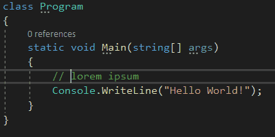

### .CharLeft

Moves the cursor one character to the left.

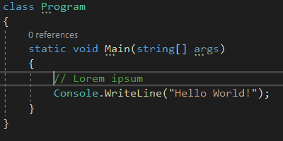

### .CharLeftExtend

Selects or extends one character to the left.

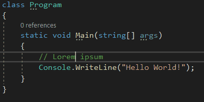

### .CharLeftExtendColumn

Selects or extends one character to the left for all selected columns.

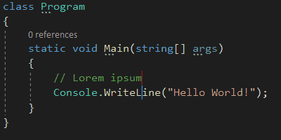

### .CharRight

Moves the cursor one character to the Right.

### .CharRightExtend

Selects or extends one character to the Right.

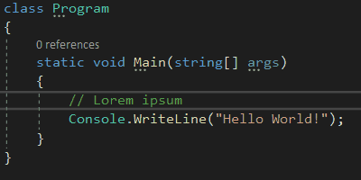

### .CharRightExtendColumn

Selects or extends one character to the Right for all selected columns.

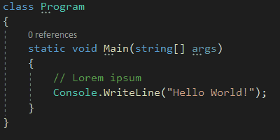

### .CharTranspose

Swap places for the character to the left and right of the cursor, and move cursor one character forward afterwards.

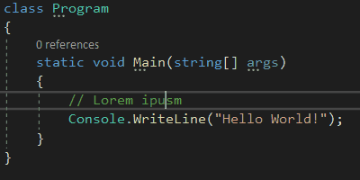

### .CheckMnemonics
### .ClearAll

🤷‍♂️

### .ClearAllBookmarksInDocument

Asks user to confirm deleting all bookmarks in current document.

### .ClearBookmarks

Asks user to confirm deleting all bookmarks in all documents.

### .ClearFindResults1	
### .ClearFindResults2

🤷‍♂️

### .ClearOutputWindow

> ⚠ Not assignable

### .CollapseAllOutlining

> 🛈 Must be [enabled](#enable-outlining)

Collapses all available regions in document.

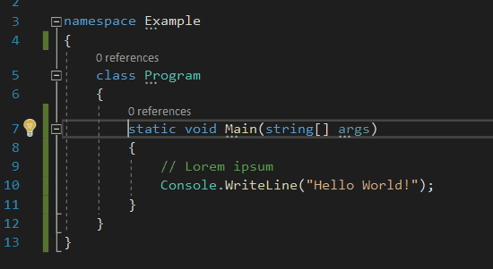

### .CollapseCurrentRegion

> 🛈 Must be [enabled](#enable-outlining)

Collapses the region the cursor currently is within.

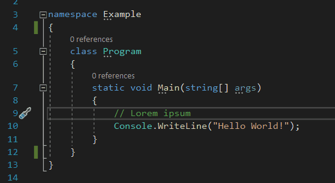

### .CollapseTag

🤷‍♂️

### .CollapsetoDefinitions

> 🛈 Must be [enabled](#enable-outlining)

Collapses every function/method and property to it's definition.  
It also collapses regions and XML documentation.

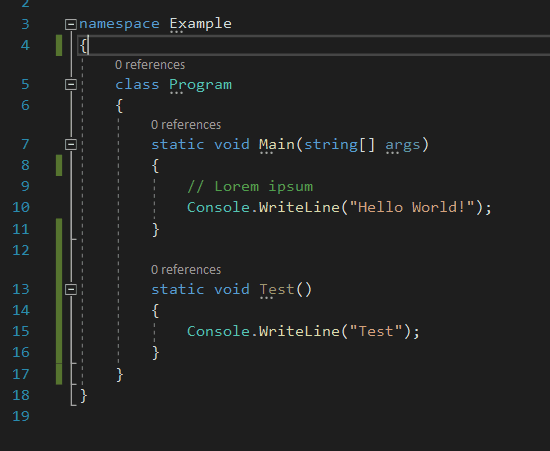

### .CommentSelection

1. Comments only selected text on the same line

   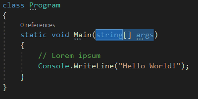

1. Comments line where the cursor is

   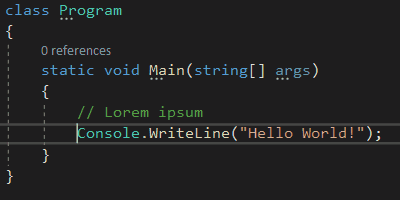

1. Comments multiple selected lines

    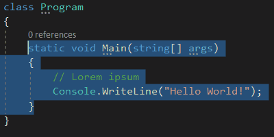

### .CompleteWord

Opens the menu with available word completions for the word you've written so far.

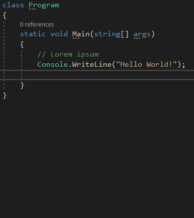

### .ContractSelection

> 🛈 Can only be used to contract selections made with [Edit.ExpandSelection](#expandselection)

Contracts selection in same increments as it was expanded.

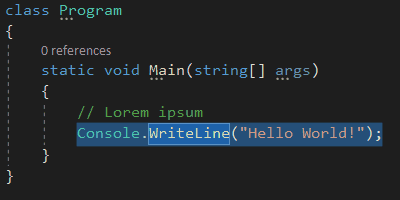

### .EmacsActivateRegion	
### .EmacsBottomOfWindow	
### .EmacsBreakLine	
### .EmacsBreakLineIndent	
### .EmacsCharLeft	
### .EmacsCharRight	
### .EmacsCharTranspose	
### .EmacsCloseOtherWindow	
### .EmacsDeleteSelection	
### .EmacsDeleteToEOL	
### .EmacsDocumentEnd	
### .EmacsDocumentStart	
### .EmacsExtendedCommand	
### .EmacsFileSaveDirty	
### .EmacsFindReplace	
### .EmacsGoToLine	
### .EmacsLineDown	
### .EmacsLineEnd	
### .EmacsLineOpen	
### .EmacsLineStart	
### .EmacsLineUp	
### .EmacsOtherWindow	
### .EmacsPasteRotate	
### .EmacsPopMark	
### .EmacsQuit	
### .EmacsQuotedInsert	
### .EmacsScrollLineCenter	
### .EmacsScrollLineTop	
### .EmacsScrollPageDown	
### .EmacsScrollPageUp	
### .EmacsSetMark	
### .EmacsSplitVertical	
### .EmacsSwapPointAndMark	
### .EmacsTopOfWindow	
### .EmacsUniversalArgument	
### .EmacsWordCapitalize	
### .EmacsWordDeleteToEnd	
### .EmacsWordDeleteToStart	
### .EmacsWordLowercase	
### .EmacsWordNext	
### .EmacsWordPrevious	
### .EmacsWordTranspose	
### .EmacsWordUppercase

> 🛈 Obsolete

These are relics from versions before VS2010 which had [Emacs](https://www.gnu.org/software/emacs/) emulation and does not work without an extension.

### .ExpandAllOutlining

> 🛈 Must be [enabled](#enable-outlining)

Expands all collapsed regions in document.

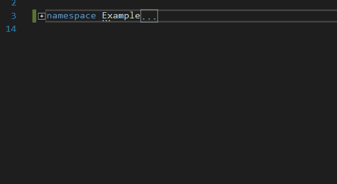

### .ExpandCurrentRegion

> 🛈 Must be [enabled](#enable-outlining)

Expands the collapsed region the cursor currently is within.

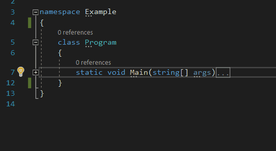

### .ExpandSelection

> 🛈 Use [Edit.ContractSelection](#contractselection) when you expand too much.

Expands selection in increments according to the code.

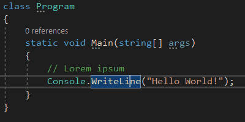

### .UncommentSelection

1. Uncomments inlined comment

    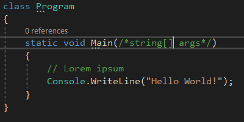

1. Uncomments commented line

   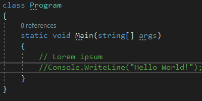

1. Uncomments multiple selected lines

   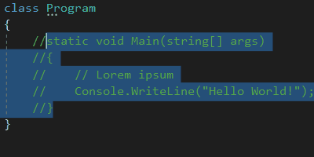

# Settings
## Enable outlining

<u>T</u>ools → <u>O</u>ptions... → Text Editor → C# → Advanced: Enter <u>o</u>utlining mode when files open