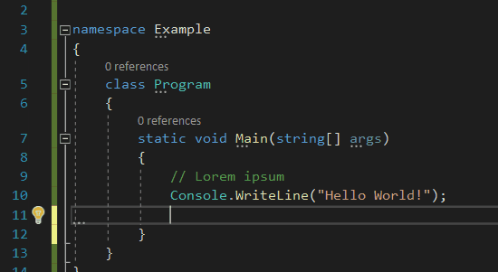

# Visual studio shortcuts
A guide to shortcuts in Visual Studio 2019. Some shortcuts have animations to better show how they work.

> ⚠ The list is far from complete!

## Edit
### .AddEventHandler
### .AddResource
### .AddRow
### .AddTagHandler

🤷‍♂️

### .BreakLine

1. Insert a new line when at end of line.

    

1. Insert new line with anything in front of cursor to the new line.

    

### .BriefBookmarkDrop0	
### .BriefBookmarkDrop1	
### .BriefBookmarkDrop2	
### .BriefBookmarkDrop3	
### .BriefBookmarkDrop4	
### .BriefBookmarkDrop5	
### .BriefBookmarkDrop6	
### .BriefBookmarkDrop7	
### .BriefBookmarkDrop8	
### .BriefBookmarkDrop9	
### .BriefBookmarks	
### .BriefBreakLine	
### .BriefBrowse	
### .BriefFileExit	
### .BriefFilePrint	
### .BriefFind	
### .BriefFindPrev	
### .BriefFindRepeat	
### .BriefFindReplace	
### .BriefFindToggleCaseSensitivity	
### .BriefFindToggleRegExpr	
### .BriefGoTo	
### .BriefGoToNextErrorTag	
### .BriefInsertFile	
### .BriefLineDelete	
### .BriefLineDeleteToEnd	
### .BriefLineDeleteToStart	
### .BriefLineIndent	
### .BriefLineOpenBelow	
### .BriefLineUnindent	
### .BriefQuotedInsert	
### .BriefSelectChar	
### .BriefSelectCharInclusive	
### .BriefSelectColumn	
### .BriefSelectLine	
### .BriefSelectSwapAnchor	
### .BriefSetRepeatCount	
### .BriefWindowLeftEdge	
### .BriefWindowMaximize	
### .BriefWindowRightEdge	
### .BriefWindowScrollDown	
### .BriefWindowScrollToBottom	
### .BriefWindowScrollToCenter	
### .BriefWindowScrollToTop	
### .BriefWindowScrollUp	
### .BriefWindowSplit	
### .BriefWindowSwitchPane	
### .BriefWordDeleteToEnd	
### .BriefWordDeleteToStart	
### .BriefWordLeft	
### .BriefWordRight

> 🛈 Obsolete

These are relics from versions before VS2010 which had [Underware Brief](https://en.wikipedia.org/wiki/Brief_(text_editor)) emulation.

### .Capitalize

Capitalizes the first character of a word. Will not change the case if invoked inside a word.

### .CharLeft

Moves the cursor one character to the left.

### .CharLeftExtend

Selects or extends one character to the left.

### .CharLeftExtendColumn

Selects or extends one character to the left for all selected columns.

### .CharRight

Moves the cursor one character to the Right.

### .CharRightExtend

Selects or extends one character to the Right.

### .CharRightExtendColumn

Selects or extends one character to the Right for all selected columns.

### .CharTranspose

Swap places for the character to the left and right of the cursor, and move cursor one character forward afterwards.

### .CheckMnemonics
### .ClearAll

🤷‍♂️

### .ClearAllBookmarksInDocument

Asks user to confirm deleting all bookmarks in current document.

### .ClearBookmarks

Asks user to confirm deleting all bookmarks in all documents.

### .ClearFindResults1	
### .ClearFindResults2

🤷‍♂️

### .ClearOutputWindow

> ⚠ Not assignable

### .CollapseAllOutlining

> 🛈 Must be [enabled](#enable-outlining)

Collapses all available regions in document.

### .CollapseCurrentRegion

> 🛈 Must be [enabled](#enable-outlining)

Collapses the region the cursor currently is within.

### .CollapseTag

🤷‍♂️

### .CollapsetoDefinitions

> 🛈 Must be [enabled](#enable-outlining)

Collapses every function/method and property to it's definition.  
It also collapses regions and XML documentation.

### .CommentSelection

1. Comments only selected text on the same line

   

1. Comments line where the cursor is

   

1. Comments multiple selected lines

    

### .CompleteWord

Opens the menu with available word completions for the word you've written so far.

### .ContractSelection

> 🛈 Can only be used to contract selections made with [Edit.ExpandSelection](#expandselection)

Contracts selection in same increments as it was expanded.

### .ConvertSpacesToTabs

Converts spaces on current line or selection to tabs.

1. Convert on current line

1. Convert on selection

### .ConvertTabsToSpaces

Converts tabs on current line or selection to spaces.

1. Convert on current line
    

1. Convert on selection
    

### .Copy

1. Without selection: Copies line with cursor to clipboard.
1. With selection: Copies selected text to clipboard.

### .CopyDiagramtoClipboard
### .CopyParameterTip

🤷‍♂️

### .CR

Change the document line ending to `CR`

### .CreateCopyofWorkItem

🤷‍♂️

### .CRLF

Change the document line ending to `CRLF`

### .Cut

1. Without selection: Cuts line with cursor to clipboard.
1. With selection: Cuts selected text to clipboard.

### .CycleClipboardRing

Cycles through the text you've put on the clipboard in Visual Studio.

### .DecreaseFilterLevel

🤷‍♂️

### .DecreaseLineIndent

Decreases the line indent wherever your cursor is placed on the line.

### .Delete

Deletes the first character in front of the cursor or selected text.

1. Delete character

    

1. Delete selection

    

### .DeleteBackwards

Deletes the first character behind the cursor or selected text.

1. Delete character

    

1. Delete selection

    

### .DeleteBlankLines

Deletes blank lines from cursor and forward until a non empty line is found, when cursor is at end of current line. 
If cursor isn't at end of line it deletes empty lines above until a non empty line is found. 
Within a selection it deletes every empty lines.

1. Delete from end of line and forward

    

1. Delete from current line and backwards

    

1. Delete from selection

    

### .DeletefromDatabase

🤷‍♂️

### .DeleteHorizontalWhiteSpace

Deletes all whitespace before and after cursor position from either start of line to text, end of text to end of line or start of text to end of text leaving a single whitespace. 
For selected text it follows the same rules but it applies to everything within the selection.

1. Delete from start of line to start of text

    

1. Delete from end of text to end of line

    

1. Delete from start of text to end of text

    

1. Delete within selected text

    

### .DeleteToBOL

Deletes everything from the cursor position to the start of the line. 
When deleting selected text it deletes only the selection when the cursor is at the end of the selection, otherwise it deletes the selection and to the start of the line.

1. Delete from cursor to start of line

    

1. Delete from cursor to start of selection

    

1. Delete from cursor to start of line including selection

    

### .DeleteToEOL

Deletes everything from the cursor position to the end of the line. 
When deleting selected text it deletes only the selection when the cursor is at the start of the selection, otherwise it deletes the selection and to the end of the line.

1. Delete from cursor to end of line

    

1. Delete from cursor to end of selection

    

1. Delete from cursor to end of line including selection

    

### .DeleteVersionInfoBlock

🤷‍♂️

### .DocumentEnd

Moves cursor to end of document.

### .DocumentEndExtend

Extends selection to end of document from cursor position.

### .DocumentStart

Moves cursor to start of document.

### .DocumentStartExtend

Extends selection to start of document from cursor position.

### .DoubleClick

🤷‍♂️

### .Duplicate

Duplicates the line where the cursor is. If there's a selection the selected text is duplicated.

1. Duplicate active line

    

1. Duplicate selected text

    

### .EditCell
### .EditIDs	
### .EditNames	
### .EditQuery	
### .EditTagHandler

🤷‍♂️

### .EmacsActivateRegion	
### .EmacsBottomOfWindow	
### .EmacsBreakLine	
### .EmacsBreakLineIndent	
### .EmacsCharLeft	
### .EmacsCharRight	
### .EmacsCharTranspose	
### .EmacsCloseOtherWindow	
### .EmacsDeleteSelection	
### .EmacsDeleteToEOL	
### .EmacsDocumentEnd	
### .EmacsDocumentStart	
### .EmacsExtendedCommand	
### .EmacsFileSaveDirty	
### .EmacsFindReplace	
### .EmacsGoToLine	
### .EmacsLineDown	
### .EmacsLineEnd	
### .EmacsLineOpen	
### .EmacsLineStart	
### .EmacsLineUp	
### .EmacsOtherWindow	
### .EmacsPasteRotate	
### .EmacsPopMark	
### .EmacsQuit	
### .EmacsQuotedInsert	
### .EmacsScrollLineCenter	
### .EmacsScrollLineTop	
### .EmacsScrollPageDown	
### .EmacsScrollPageUp	
### .EmacsSetMark	
### .EmacsSplitVertical	
### .EmacsSwapPointAndMark	
### .EmacsTopOfWindow	
### .EmacsUniversalArgument	
### .EmacsWordCapitalize	
### .EmacsWordDeleteToEnd	
### .EmacsWordDeleteToStart	
### .EmacsWordLowercase	
### .EmacsWordNext	
### .EmacsWordPrevious	
### .EmacsWordTranspose	
### .EmacsWordUppercase

> 🛈 Obsolete

These are relics from versions before VS2010 which had [Emacs](https://www.gnu.org/software/emacs/) emulation and does not work without an extension.

### .EnableAllBookmarks

Toggles all bookmarks enabled/disabled status.

### .EnableBookmark

Toggles bookmark enabled/disabled status on current line.

### .ExpandAllOutlining

> 🛈 Must be [enabled](#enable-outlining)

Expands all collapsed regions in document.

### .ExpandCurrentRegion

> 🛈 Must be [enabled](#enable-outlining)

Expands the collapsed region the cursor currently is within.

### .ExpandSelection

> 🛈 Use [Edit.ContractSelection](#contractselection) when you expand too much.

Expands selection in increments according to the code.

### .ExpandSelectiontoContainingBlock

Selects the containing block in which the cursor currently resides and expands outwards if performed multiple times.

### .LF

Change the document line ending to `LF`

### .UncommentSelection

1. Uncomments inlined comment

    

1. Uncomments commented line

   

1. Uncomments multiple selected lines

   

# Settings
## Enable outlining

<u>T</u>ools → <u>O</u>ptions... → Text Editor → C# → Advanced: Enter <u>o</u>utlining mode when files open